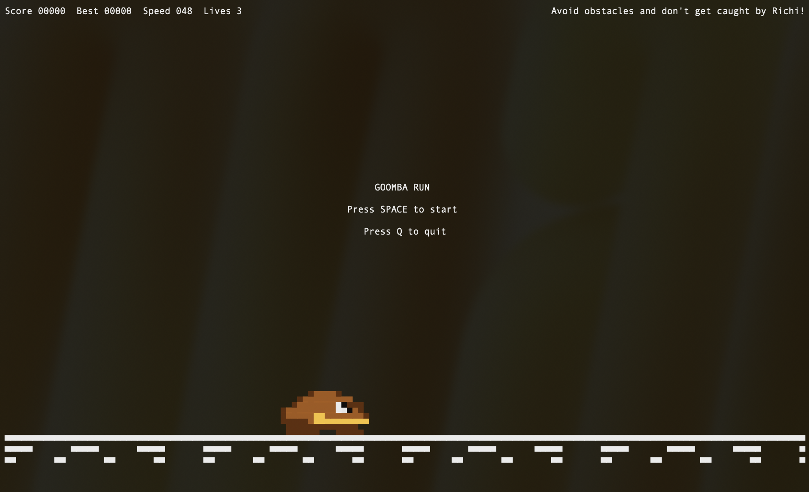
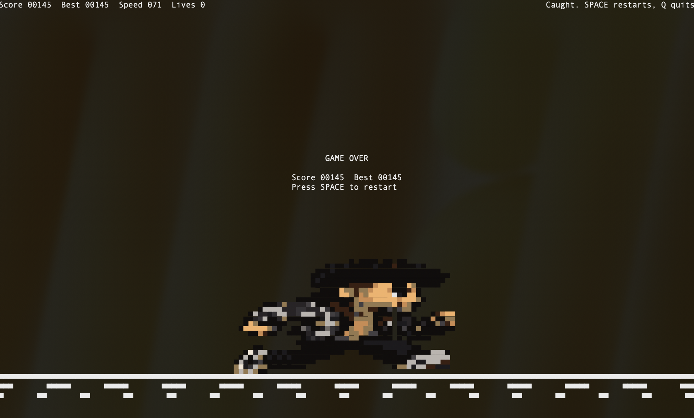

# Goomba CLI Runner

Fast terminal endless runner written in Go, rendered with ANSI color and half-block pixels.

| Start | Game Over |
| --- | --- |
|  |  |

## Highlights

- Custom pixel-art sprites:
  - Goomba (`16x8`)
  - Richi (`48x24`) [myself]
- Smooth fixed-timestep gameplay (`30 FPS`)
- Progressive difficulty
- 3-life chase loop:
  - Obstacle hit -> lose life
  - Richi gets closer after each hit
  - Final caught sequence with kick-out game-over scene
- Pause support (`ESC`) without quitting the game

## Requirements

- Go `1.24+`
- Terminal with color + Unicode block character support
- Minimum terminal size: `90x25`
- Recommended size: `130x40` or larger

## Run

```bash
go run .
```

## Controls

- `SPACE`: Jump
- `SPACE` in air: Double jump
- `ESC`: Pause / resume
- `Q`: Quit
- `Ctrl+C`: Quit

## Gameplay

1. Press `SPACE` to start.
2. Avoid obstacles and increase your score, while the run gets faster.
3. Survive 2 hits before Richi catches up.
4. After game over, press `SPACE` to restart.

## Rendering Notes

- Uses Unicode half-block glyphs: `▀`, `▄`, `█`
- Pixel world is rendered in terminal cells with top/bottom color blending
